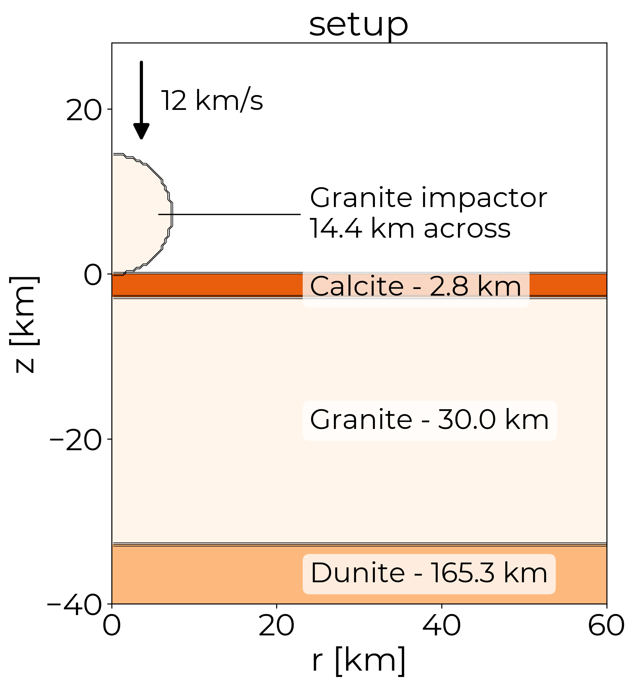
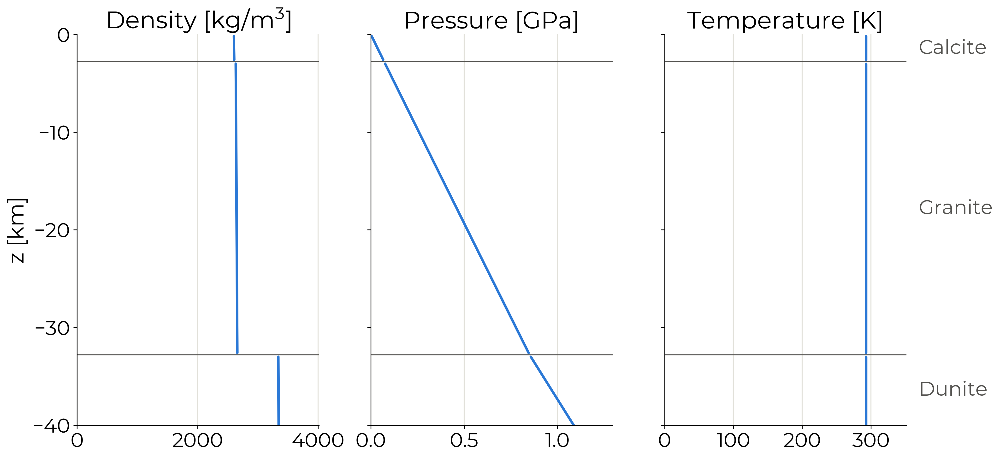

# Chicxulub - model setup

# Disclaimer

This summary is generated by an LLM (Claude Opus 5) and may contain errors. Please check the original sources for accuracy.

The setup is taken from the iSALE tutorial examples:

https://github.com/isale-code/isale-wiki/wiki/Chicxulub-crater-formation

# Summary

Generated by `Plotting/MatTmpPresentation.py` from `asteroid.inp` and the material, density, pressure and temperature fields of timestep 0. Depths are relative to the pre-impact target surface; negative is downwards.

## Impactor

| property | value |
| --- | --- |
| material | `granite` - Granite (continental crust) |
| diameter | 14.4 km (18 cells per radius) |
| impact velocity | 12 km/s, vertical (downwards) |
| shape | SPHEROID |
| initial damage | 1 (fully damaged) |

## Target layers (top to bottom)

| # | iSALE material | what it represents | top [km] | bottom [km] | thickness [km] |
| --- | --- | --- | --- | --- | --- |
| 1 | `calcite` | Calcite - sedimentary cover | 0.0 | -2.8 | 2.8 |
| 2 | `granite` | Granite - continental crust | -2.8 | -32.8 | 30.0 |
| 3 | `dunite_` | Dunite - upper mantle | -32.8 | -198.1 | 165.3 (to mesh base) |

The deepest layer is a half-space: it fills the mesh down to z = -198.1 km rather than having a physical base.

## Initial state of the target

Density, pressure and temperature at t = 0, down the column of cells at r = 75.0 km that the layer table is read from. The pressure is lithostatic under a constant gravity of 9.81 m/s^2: 1.09 GPa at z = -40 km and 6.24 GPa at the base of the mesh. The whole target starts at 293 K (`LAYTPROF` = CONST : CONST : CONST).

## Material models

| iSALE material | EOS | strength | damage | porosity |
| --- | --- | --- | --- | --- |
| `granite` | aneos | ROCK | IVANOV | NONE |
| `dunite_` | aneos | ROCK | IVANOV | NONE |
| `calcite` | aneos | ROCK | IVANOV | NONE |

## Numerics

- Geometry: cylindrical (axisymmetric) 2D
- Cell size 400 m; high-resolution zone 250 x 200 cells
- Extension zones: 0/60 cells horizontally, 60/20 vertically, growing by a factor 1.05 per cell
- Surface temperature 293 K, gravity 9.81 m/s^2
- Runs to 600.1 s of simulated time, saved every 5 s (121 steps in the data file)
- Wall-clock runtime: **3 h 18 min** (11883.9 s, from `output.txt0`)

## One-line version for the talk

A 14.4 km granite impactor strikes at 12 km/s into 2.8 km of calcite, then 30.0 km of granite, on top of a dunite half-space.
